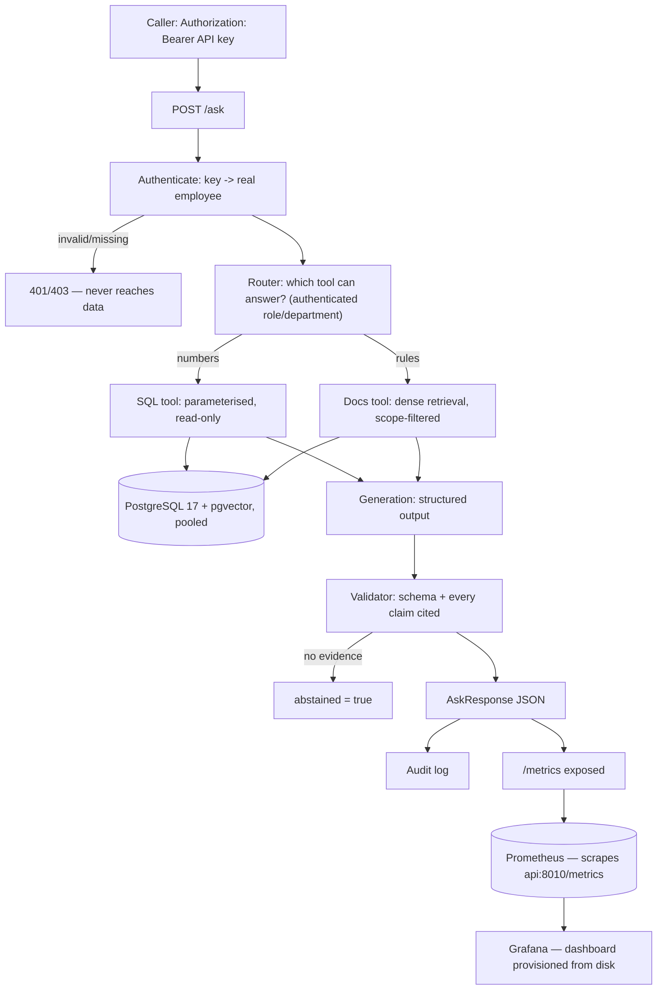

# Enterprise AI Decision Platform

An internal question-answering API for a company: an employee asks in natural
language, the system decides whether the answer lives in **business data (SQL)**
or in **internal policy documents (retrieval)**, and answers **with citations**,
**only within the asker's access scope**, while **logging every request for
audit**.

> **Status: final report, round 2, on a fresh held-out set.** After the corpus moved
> to full-diacritic Vietnamese (ADR-022), the round-1 held-out set and results were
> kept as history and a genuinely new 12-question set (`eval/final.jsonl`) was
> written and run **once**, through the real, running `/ask` endpoint with real
> authentication — 11/12 correct, 1 genuine router mistake (the same failure mode as
> round 1's, recurring after a prior fix — see below), 0 infrastructure errors in the
> final state. Mid-run, a real reliability gap was found and fixed: `src/embeddings.py`
> had no retry logic at all, unlike generation/router calls, so a single transient
> 503 from the embedding API killed any docs-touching request outright (ADR-024).
> Real p50/p95 latency and real per-request token cost, read from `audit_log`. Full
> results and why the recurring router mistake was left unpatched:
> [`docs/report.md`](docs/report.md) ("Final report, round 2") and ADR-024. Round 1's
> report (9/12, on the pre-diacritics corpus) is kept as history in the same file.
>
> `/ask` requires a real API key (`Authorization: Bearer <key>`) — RBAC runs on
> the **authenticated** role/department, not a self-declared request field, closing a
> real vulnerability found by testing (ADR-015, exact `curl` before/after in
> `docs/report.md`). Every request is written to `audit_log` and exposed on
> `/metrics` (Prometheus). `/ask` routes each question (Gemini classifies `sql` /
> `docs` / both) and returns SQL figures verbatim, never rephrased by an LLM.
> Retrieval baseline: 18/18 answerable questions retrieved correctly, 0 fabricated
> citations, 0 access violations across 25 dev questions; hybrid retrieval was
> measured and **not built** — 5/5 recall on 5 deliberately hard paraphrases, no gap
> to fill (ADR-011). Build order and progress: [`AGENTS.md`](AGENTS.md#7-kế-hoạch-xây-dựng).
> A full, guided reading order for the whole project is in
> [`docs/reading_order.md`](docs/reading_order.md).

## Why this project

Three properties decide whether an enterprise can actually use an LLM assistant,
and all three are usually missing from demos:

| Property | What it means here |
|---|---|
| **Verifiable answers** | Every claim carries a citation — a document chunk or the SQL statement that produced the number. An answer that cannot be traced is treated as a failure, not a success. |
| **Access control that holds** | Scope is applied as a filter in the SQL `WHERE` clause and the retrieval query, *before* any text reaches the model. The model never sees a chunk the caller may not read. Telling a model "do not reveal restricted documents" is an instruction, not a boundary. |
| **Measured, not asserted** | Retrieval changes are evaluated against a fixed question set with a baseline measured first. "Hybrid search is better" is only a claim if there is a number behind it. |

## Architecture



`db`, `api`, `prometheus`, `grafana` are four separate containers (`compose.yaml`) —
observability is not bolted onto the API process, it is its own service scraping a
public HTTP endpoint, same as it would run against a real deployment.

Full detail in [`docs/architecture.md`](docs/architecture.md). Design choices and
the reasoning behind them are recorded in [`docs/decisions.md`](docs/decisions.md).

## Quick start

Requirements: Docker, [uv](https://docs.astral.sh/uv/), Python 3.12.

```bash
git clone https://github.com/anhquan1111/enterprise-ai-decision-platform.git
cd enterprise-ai-decision-platform
cp .env.example .env
# paste a Google AI Studio key into LLM_API_KEY — needed for embeddings and generation

uv sync --extra dev
docker compose up -d db

# Schema, business data, then the document corpus
docker compose exec -T db psql -U app -d enterprise_ai -f /sql/00_extensions.sql
docker compose exec -T db psql -U app -d enterprise_ai -f /sql/01_schema.sql
docker compose exec -T db psql -U app -d enterprise_ai -f /sql/02_seed.sql
docker compose exec -T db psql -U app -d enterprise_ai -f /sql/06_auth.sql
uv run python -m scripts.ingest
uv run python -m scripts.backfill_embeddings    # embeds the 16 chunks, idempotent
uv run python -m scripts.issue_api_keys         # prints one real key per employee, ONCE

uv run uvicorn src.api:app --reload --port 8010
# http://127.0.0.1:8010/docs
```

Ask it something (needs a real key from `issue_api_keys` — `/ask` requires
`Authorization: Bearer <key>`; without it, or with a role that doesn't match
the key's real owner, the request is rejected before touching any data — see
[`docs/report.md`](docs/report.md) (auth & reliability section) for why):

```bash
KEY="<paste emp_006's key here — engineering/employee>"

curl -s -X POST http://127.0.0.1:8010/ask -H "Content-Type: application/json" \
  -H "Authorization: Bearer $KEY" -d '{
  "user_id": "emp_006", "role": "employee", "department": "engineering",
  "question": "Neu mot ban release bi loi thi phai lam gi?"
}'
# routes to the docs tool, cites ENG-007#1. Ask the same question about an
# executive-only expense limit and it abstains instead of guessing.

curl -s -X POST http://127.0.0.1:8010/ask -H "Content-Type: application/json" \
  -H "Authorization: Bearer $KEY" -d '{
  "user_id": "emp_006", "role": "executive", "department": "finance",
  "question": "Doanh thu phong finance thang 1 nam 2026 la bao nhieu?"
}'
# 403 — the key belongs to an "employee" in "engineering"; the body's self-declared
# role/department doesn't match, so the request never reaches the agent. Role and
# department for RBAC always come from the authenticated key, never the request body.
```

See how the contract rejects bad data, without touching the clean corpus:

```bash
uv run python -m scripts.ingest data/documents_dirty.csv
# 8 rows in, 0 accepted, 8 quarantined — each with a readable reject_reason
```

Verify:

```bash
curl http://127.0.0.1:8010/health    # liveness, no DB call
curl http://127.0.0.1:8010/ready     # readiness, checks PostgreSQL
curl http://127.0.0.1:8010/metrics   # Prometheus scrape endpoint, no auth required
uv run pytest tests/ -v -m "not integration and not live_llm"   # fast, no network
uv run pytest tests/ -v -m integration                          # needs the db container
uv run pytest tests/ -v -m live_llm                              # calls real Gemini, spends quota
uv run python -m scripts.run_eval --report                       # baseline numbers, no calls
```

## Metrics and dashboards

`/metrics` existed unused for a while — nothing scraped it until Prometheus and
Grafana were added as their own containers (`compose.yaml`), not bolted onto the API
process:

```bash
docker compose up -d db api prometheus grafana
```

- Prometheus: [http://127.0.0.1:9090](http://127.0.0.1:9090) — `/targets` shows
  `enterprise-ai-api` as `UP` once the API container is healthy.
- Grafana: [http://127.0.0.1:3000](http://127.0.0.1:3000) — login `admin`/`admin`
  (change via `GRAFANA_ADMIN_PASSWORD` in `.env`), dashboard **"Enterprise AI Decision
  Platform - /ask overview"** is provisioned automatically from
  `docker/grafana/dashboards/` — nothing to click through by hand. Panels: request
  rate by status/tool, p50/p95 latency, auth failure rate, all reading the exact
  three metrics `src/metrics.py` defines.

## Tech stack

Python 3.12 · FastAPI · PostgreSQL 17 + pgvector 0.8.6 · psycopg 3 (raw SQL, no
ORM, pooled connections via `psycopg_pool`) · Pydantic 2 · Gemini
(`gemini-3.1-flash-lite` for generation and the agent router, `gemini-embedding-001`
at 384 dims) via plain `httpx` (no SDK, no function-calling API — the router uses
JSON mode, same pattern as generation) · prometheus-client (metrics) · pytest ·
ruff · mypy · Docker Compose · GitHub Actions. MLflow is declared as an extra for
later layers; not used yet. BM25/hybrid retrieval was evaluated during agent
development and deliberately not built — see ADR-011 in
[`docs/decisions.md`](docs/decisions.md).

## Project layout

```text
src/
├── api.py             # FastAPI app: /health, /ready, /metrics, /ask
├── config.py          # Settings from env/.env
├── contracts.py       # Data contract: rules, severity, role visibility
├── db.py              # psycopg helpers, pooled connections + statement timeout
├── auth.py             # API key -> authenticated employee (real AuthN)
├── audit.py             # writes audit_log (table existed unused for a while)
├── metrics.py            # Prometheus counters/histogram for /ask
├── embeddings.py       # Gemini embedding calls, one function for ingest and query
├── retrieval.py         # Dense retrieval: scope + point-in-time filter, then cosine rank
├── generation.py       # Structured output: JSON mode, retry-with-error, two gates
├── eval_taxonomy.py     # 8-label error classifier (access / knowledge / retrieval / generation)
├── scope.py            # Role -> visible access levels (docs); role+dept -> SQL access
├── agent/               # router + 2 tools + bounded orchestration pipeline
│   ├── router.py          # Gemini JSON mode: classifies sql / docs / both
│   ├── tools.py            # sql_tool (RBAC before query), docs_tool (wraps retrieval.py)
│   ├── schema.py            # ToolPlan / SqlArgs, two-layer validation
│   └── loop.py               # route -> RBAC -> execute (retry/timeout) -> summarize
└── schemas.py           # Request/response contracts

scripts/
├── ingest.py                     # read -> validate -> quarantine -> upsert -> manifest
├── backfill_embeddings.py        # embeds chunks with embedding IS NULL, idempotent
├── issue_api_keys.py             # issues one real API key per employee, once
├── run_eval.py                   # scores eval/dev.jsonl (docs-only retrieval pipeline), resumable
├── run_held_out_eval.py          # scores eval/final.jsonl through the real /ask HTTP API, once
├── probe_retrieval_headroom.py   # one-off: checked for a hybrid-retrieval gap (ADR-011)
└── probe_router_combined_tools.py # one-off: measured router accuracy on combined sql+docs questions

sql/                # 00 extensions, 01 schema, 02 seed, 03-05 queries/EXPLAIN, 06 auth
data/               # Synthetic corpus (16 chunks) + a deliberately dirty batch
eval/               # dev.jsonl (25 questions, open); final.jsonl (12 questions, sealed)
evidence/           # Raw outputs behind every number quoted here
docs/               # architecture.md, decisions.md, query_plan.md, report.md, runbook.md,
                    # demo_script.md, cv_bullets.md, reading_order.md
docker/
├── prometheus/prometheus.yml          # scrapes api:8010/metrics every 15s
└── grafana/provisioning/              # datasource + "ask-overview" dashboard,
                                        # applied on start, nothing to click through
tests/              # Fast unit tests (mocked); `integration` needs Postgres;
                    # `live_llm` calls real Gemini — neither runs in CI
```

### What the data layer enforces

| Layer | Catches |
|---|---|
| `src/contracts.py` | Duplicate keys, missing required fields, values outside the allowed set, reversed validity intervals, `available_at` before `published_at`. Rejected rows go to `doc_chunks_quarantine` with a readable reason. |
| PostgreSQL constraints | The same rules again, so a migration script or a manual fix during an incident cannot bypass them. |
| `ingest_run` table | One manifest row per run: counts per rule, and a `CHECK` that accepted + quarantined equals rows in file. |

Query plans for the retrieval path, measured at 16 and ~20k rows, are in
[`docs/query_plan.md`](docs/query_plan.md).

## Evaluation

Full numbers, the model name, the date, and two measurement bugs found while
getting them: [`docs/report.md`](docs/report.md). Summary:

| Metric | Retrieval baseline (25 questions, `gemini-3.1-flash-lite`) |
|---|---|
| recall@3 / @5 / @10 | 18/18 (100%) — flat because gold ranked first every time |
| MRR | 1.000 |
| Correct answers | 18/18 |
| Correctly refused (access / no-knowledge) | 5/5, 2/2 |
| Fabricated citations, access violations, retrieval misses | 0 |

Reproduce: `uv run python -m scripts.run_eval --report` (reads results already
on disk) or `uv run python -m scripts.run_eval` (calls the real API).

`eval/final.jsonl` started out deliberately empty. It held 5 questions that were
scored too early — before the agent and RBAC/audit existed, so the
result would not describe the finished system. They were folded into
`eval/dev.jsonl` instead of deleted or silently rerun; see ADR-010 in
`docs/decisions.md`. The final report below draws a genuinely fresh held-out set,
written once the agent and auth layer both existed.

Before building it, hybrid retrieval was also measured for whether it had anything
to improve: 5 deliberately hard paraphrases, chosen to share as little vocabulary as
possible with existing dev questions, still resolved with 100% recall@3. Hybrid was
not built — see ADR-011 and
[`evidence/hybrid_headroom_probe.json`](evidence/hybrid_headroom_probe.json).

### Held-out set, round 2, run once

| Metric | Result |
|---|---|
| Held-out questions | 12 (`eval/final.jsonl`), genuinely new — see ADR-024 |
| Correct | 11/12 |
| Infrastructure errors in the final state | 0/12 (a real `embeddings.py` retry gap was found and fixed mid-run — see ADR-024) |
| Router picked the wrong tool for a combined sql+docs question | 1/12 (recurrence of round 1's finding, after a fix that measured 6/6 on a probe — ADR-024) |
| Latency p50 / p95 (real HTTP, all 12 completed) | 8,394 ms / 21,045 ms (unusually high — real Gemini congestion that day, see ADR-024) |
| Token cost, real (`audit_log.total_tokens`) | 834.4 mean / request → $0.0025–$0.015 for the run (~65–390 VND), a range not a point estimate — see ADR-023 |

Reproduce: `uv run python -m scripts.run_held_out_eval --report` (the run itself
cannot be repeated — it is sealed; see `docs/report.md`, "Final report, round 2").
Round 1 (9/12, on the pre-diacritics corpus, 12 different questions) is kept as
history in the same report and in `eval/final_v1_pre_diacritics.jsonl` — see
ADR-022. The recurring router mistake (H21) was deliberately **not**
fixed-and-rerun — doing so on an already-scored held-out set would defeat its
purpose; see ADR-024.

## Limits

- The corpus is **synthetic**, written for this project. No real company documents.
- Exact vector search, no ANN index. Correct at a few hundred chunks; not a claim
  about scale.
- 25 questions on a 16-chunk corpus is a learning-scale evaluation. Zero failures
  in every error category is a real result on this dataset, not evidence the
  system is reliable in general — see "Not yet measured" in `docs/report.md` for
  what this baseline does not tell you.
- A question asking for both a number and a policy in one sentence used to be
  routed to only one tool sometimes (observed during agent development, confirmed
  again by the round-1 held-out set). The router prompt was strengthened
  afterward and measured 6/6 on a fresh probe
  (`evidence/router_combined_tools_probe.json`) — a real improvement on a small
  sample, not a guarantee at scale (ADR-020). It recurred in round 2's held-out
  set (H21), on a question the probe never saw — 6 examples were not enough to
  call the gap closed (ADR-024). **A larger, dedicated 18-question follow-up
  probe then found zero reproducible failures against the unmodified prompt**
  — even questions deliberately shaped like H21 selected both tools correctly.
  ~2 misses out of ~26 combined-question attempts project-wide is consistent
  with ordinary LLM stochasticity, not a systematic prompt gap; left unpatched
  since there is no failing case to target a fix at. See ADR-027.
- A self-contradictory model response (`abstained: true` with a non-empty
  `citations` list) used to 502 after exhausting retries — fixed to degrade to a
  plain abstain instead (citations dropped, logged in `grounding_problems`). See
  ADR-020.
- A raw network timeout talking to Gemini (`httpx.TimeoutException`/`ConnectError`)
  used to skip the retry loop entirely — fixed to retry the same as an HTTP 503.
  See ADR-020.
- AuthN is a possession-based API key, not JWT/OAuth2 — no built-in expiry or
  instant revocation, only manual deletion of `api_key_hash`. See ADR-015.
- Retry jitter was added for the exact mechanism measured causing concurrent
  `503`s (ADR-016) and has since been re-measured under real concurrent load
  (8 trials × 3 concurrent requests, both with and without jitter) — no
  measurable benefit detected under the session's real (unusually severe)
  Gemini congestion; the retry budget itself is too short to outlast a
  sustained outage, a different gap than the one jitter closes. See ADR-026.
- Token cost is converted to VND/USD as a bounded range (`audit_log` stores only
  the combined token count, not the input/output split) — see ADR-023.
- Not deployed to any cloud provider. It runs locally via Docker Compose.

## Demo and CV material

- [`docs/demo_script.md`](docs/demo_script.md) — a 2-3 minute walkthrough script,
  built entirely from commands and outputs already reproducible above.
- [`docs/cv_bullets.md`](docs/cv_bullets.md) — CV bullets, each traceable to a file or
  ADR in this repo, no number written that isn't measured somewhere in `evidence/`.

## License

MIT
