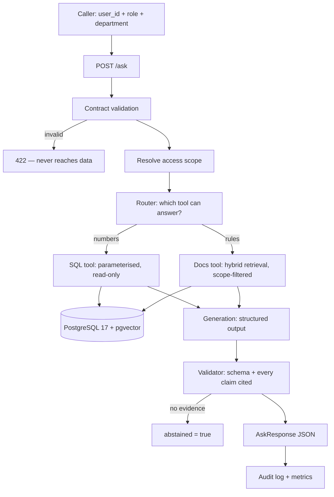

# Enterprise AI Decision Platform

An internal question-answering API for a company: an employee asks in natural
language, the system decides whether the answer lives in **business data (SQL)**
or in **internal policy documents (retrieval)**, and answers **with citations**,
**only within the asker's access scope**, while **logging every request for
audit**.

> **Status: D1 — data layer.** PostgreSQL schema, synthetic business data and a
> contract-validated document ingestion pipeline are in place and tested. The
> answer path is not implemented yet: `/ask` returns `501` on purpose rather than
> returning a plausible-looking placeholder. Build order and progress are tracked
> in [`AGENTS.md`](AGENTS.md#7-session-plan-d0--d5).

## Why this project

Three properties decide whether an enterprise can actually use an LLM assistant,
and all three are usually missing from demos:

| Property | What it means here |
|---|---|
| **Verifiable answers** | Every claim carries a citation — a document chunk or the SQL statement that produced the number. An answer that cannot be traced is treated as a failure, not a success. |
| **Access control that holds** | Scope is applied as a filter in the SQL `WHERE` clause and the retrieval query, *before* any text reaches the model. The model never sees a chunk the caller may not read. Telling a model "do not reveal restricted documents" is an instruction, not a boundary. |
| **Measured, not asserted** | Retrieval changes are evaluated against a fixed question set with a baseline measured first. "Hybrid search is better" is only a claim if there is a number behind it. |

## Architecture



Full detail in [`docs/architecture.md`](docs/architecture.md). Design choices and
the reasoning behind them are recorded in [`docs/decisions.md`](docs/decisions.md).

## Quick start

Requirements: Docker, [uv](https://docs.astral.sh/uv/), Python 3.12.

```bash
git clone https://github.com/anhquan1111/enterprise-ai-decision-platform.git
cd enterprise-ai-decision-platform
cp .env.example .env

uv sync --extra dev
docker compose up -d db

# Schema, business data, then the document corpus
docker compose exec -T db psql -U app -d enterprise_ai -f /sql/00_extensions.sql
docker compose exec -T db psql -U app -d enterprise_ai -f /sql/01_schema.sql
docker compose exec -T db psql -U app -d enterprise_ai -f /sql/02_seed.sql
uv run python -m scripts.ingest

uv run uvicorn src.api:app --reload --port 8010
# http://127.0.0.1:8010/docs
```

See how the contract rejects bad data, without touching the clean corpus:

```bash
uv run python -m scripts.ingest data/documents_dirty.csv
# 8 rows in, 0 accepted, 8 quarantined — each with a readable reject_reason
```

Verify:

```bash
curl http://127.0.0.1:8010/health    # liveness, no DB call
curl http://127.0.0.1:8010/ready     # readiness, checks PostgreSQL
uv run pytest tests/ -v -m "not integration"
uv run pytest tests/ -v -m integration    # needs the db container
```

## Tech stack

Python 3.12 · FastAPI · PostgreSQL 17 + pgvector 0.8.6 · psycopg 3 (raw SQL, no
ORM) · Pydantic 2 · pytest · ruff · mypy · Docker Compose · GitHub Actions.
MLflow (eval run tracking) and prometheus-client arrive with the layers that use
them.

## Project layout

```text
src/
├── api.py          # FastAPI app: /health, /ready, /ask
├── config.py       # Settings from env/.env
├── contracts.py    # Data contract: rules, severity, role visibility
├── db.py           # psycopg helpers, read-only sessions on the query path
└── schemas.py      # Request/response contracts

scripts/ingest.py   # read -> validate -> quarantine -> upsert -> manifest
sql/                # 00 extensions, 01 schema, 02 seed, 03-05 queries and EXPLAIN
data/               # Synthetic corpus (16 chunks) + a deliberately dirty batch
eval/               # Evaluation questions with ground truth (committed on purpose)
evidence/           # Raw outputs behind every number quoted here
docs/               # architecture.md, decisions.md, query_plan.md, report.md
tests/              # Contract tests; integration tests marked and opt-in
```

### What the data layer enforces

| Layer | Catches |
|---|---|
| `src/contracts.py` | Duplicate keys, missing required fields, values outside the allowed set, reversed validity intervals, `available_at` before `published_at`. Rejected rows go to `doc_chunks_quarantine` with a readable reason. |
| PostgreSQL constraints | The same rules again, so a migration script or a manual fix during an incident cannot bypass them. |
| `ingest_run` table | One manifest row per run: counts per rule, and a `CHECK` that accepted + quarantined equals rows in file. |

Query plans for the retrieval path, measured at 16 and ~20k rows, are in
[`docs/query_plan.md`](docs/query_plan.md).

## Evaluation

Numbers appear here only once they exist, each pointing at a file in
`evidence/`. The plan, fixed in advance:

- ~40 hand-written questions with ground-truth document ids, split into **28 for
  development** and **12 held out** until the final run.
- Retrieval measured with recall@5 and MRR; answers measured on citation
  correctness and on whether the system correctly abstains when the corpus (or
  the caller's scope) has no answer.
- Absolute counts reported alongside percentages. On 28 questions, one question
  is ~3.6% — inside the noise, and reported as such.

## Limits

- The corpus is **synthetic**, written for this project. No real company documents.
- Exact vector search, no ANN index. Correct at a few hundred chunks; not a claim
  about scale.
- A 40-question set is a learning-scale evaluation. It is enough to locate
  failures and compare two configurations; it is not evidence that the system is
  reliable in general.
- Not deployed to any cloud provider. It runs locally via Docker Compose.

## License

MIT
