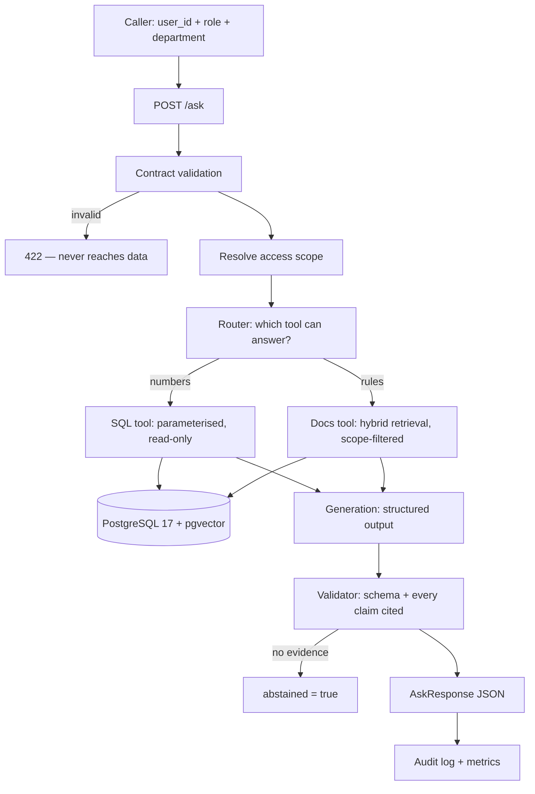

# Enterprise AI Decision Platform

An internal question-answering API for a company: an employee asks in natural
language, the system decides whether the answer lives in **business data (SQL)**
or in **internal policy documents (retrieval)**, and answers **with citations**,
**only within the asker's access scope**, while **logging every request for
audit**.

> **Status: D2 — dense retrieval answers document questions, measured.** `/ask`
> retrieves with real embeddings (RBAC and point-in-time filtered before ranking),
> generates a structured answer, and checks it against two gates. Baseline: 18/18
> answerable questions retrieved correctly, 0 fabricated citations, 0 access
> violations across 25 questions — see [`docs/report.md`](docs/report.md) for the
> model name, the date, and the two measurement bugs found and fixed while getting
> that number. Not yet built: the SQL business-data tool and the router between it
> and documents (D3), audit logging (D4). Build order and progress are tracked in
> [`AGENTS.md`](AGENTS.md#7-session-plan-d0--d5). A guided reading order for D0+D1
> is in [`docs/reading_order.md`](docs/reading_order.md) (not yet updated for D2).

## Why this project

Three properties decide whether an enterprise can actually use an LLM assistant,
and all three are usually missing from demos:

| Property | What it means here |
|---|---|
| **Verifiable answers** | Every claim carries a citation — a document chunk or the SQL statement that produced the number. An answer that cannot be traced is treated as a failure, not a success. |
| **Access control that holds** | Scope is applied as a filter in the SQL `WHERE` clause and the retrieval query, *before* any text reaches the model. The model never sees a chunk the caller may not read. Telling a model "do not reveal restricted documents" is an instruction, not a boundary. |
| **Measured, not asserted** | Retrieval changes are evaluated against a fixed question set with a baseline measured first. "Hybrid search is better" is only a claim if there is a number behind it. |

## Architecture



Full detail in [`docs/architecture.md`](docs/architecture.md). Design choices and
the reasoning behind them are recorded in [`docs/decisions.md`](docs/decisions.md).

## Quick start

Requirements: Docker, [uv](https://docs.astral.sh/uv/), Python 3.12.

```bash
git clone https://github.com/anhquan1111/enterprise-ai-decision-platform.git
cd enterprise-ai-decision-platform
cp .env.example .env
# paste a Google AI Studio key into LLM_API_KEY — needed for embeddings and generation

uv sync --extra dev
docker compose up -d db

# Schema, business data, then the document corpus
docker compose exec -T db psql -U app -d enterprise_ai -f /sql/00_extensions.sql
docker compose exec -T db psql -U app -d enterprise_ai -f /sql/01_schema.sql
docker compose exec -T db psql -U app -d enterprise_ai -f /sql/02_seed.sql
uv run python -m scripts.ingest
uv run python -m scripts.backfill_embeddings    # embeds the 16 chunks, idempotent

uv run uvicorn src.api:app --reload --port 8010
# http://127.0.0.1:8010/docs
```

Ask it something:

```bash
curl -s -X POST http://127.0.0.1:8010/ask -H "Content-Type: application/json" -d '{
  "user_id": "emp_042", "role": "employee", "department": "engineering",
  "question": "Neu mot ban release bi loi thi phai lam gi?"
}'
# cites ENG-007#1 and answers correctly. Ask the same question as role "employee"
# about an executive-only expense limit and it abstains instead of guessing.
```

See how the contract rejects bad data, without touching the clean corpus:

```bash
uv run python -m scripts.ingest data/documents_dirty.csv
# 8 rows in, 0 accepted, 8 quarantined — each with a readable reject_reason
```

Verify:

```bash
curl http://127.0.0.1:8010/health    # liveness, no DB call
curl http://127.0.0.1:8010/ready     # readiness, checks PostgreSQL
uv run pytest tests/ -v -m "not integration and not live_llm"   # fast, no network
uv run pytest tests/ -v -m integration                          # needs the db container
uv run pytest tests/ -v -m live_llm                              # calls real Gemini, spends quota
uv run python -m scripts.run_eval --report                       # baseline numbers, no calls
```

## Tech stack

Python 3.12 · FastAPI · PostgreSQL 17 + pgvector 0.8.6 · psycopg 3 (raw SQL, no
ORM) · Pydantic 2 · Gemini (`gemini-3.1-flash-lite` generation,
`gemini-embedding-001` at 384 dims) via plain `httpx` (no SDK) · pytest · ruff ·
mypy · Docker Compose · GitHub Actions. MLflow and prometheus-client are declared
as an extra for later layers; not used yet.

## Project layout

```text
src/
├── api.py             # FastAPI app: /health, /ready, /ask (dense retrieval + generation)
├── config.py          # Settings from env/.env
├── contracts.py       # Data contract: rules, severity, role visibility
├── db.py              # psycopg helpers, read-only sessions on the query path
├── embeddings.py       # Gemini embedding calls, one function for ingest and query
├── retrieval.py         # Dense retrieval: scope + point-in-time filter, then cosine rank
├── generation.py       # Structured output: JSON mode, retry-with-error, two gates
├── eval_taxonomy.py     # 8-label error classifier (access / knowledge / retrieval / generation)
├── scope.py            # Role -> visible access levels
└── schemas.py           # Request/response contracts

scripts/
├── ingest.py               # read -> validate -> quarantine -> upsert -> manifest
├── backfill_embeddings.py  # embeds chunks with embedding IS NULL, idempotent
└── run_eval.py             # scores eval/dev.jsonl or eval/final.jsonl, resumable

sql/                # 00 extensions, 01 schema, 02 seed, 03-05 queries and EXPLAIN
data/               # Synthetic corpus (16 chunks) + a deliberately dirty batch
eval/               # dev.jsonl (25 questions, open); final.jsonl (empty — see docs/report.md)
evidence/           # Raw outputs behind every number quoted here
docs/               # architecture.md, decisions.md, query_plan.md, report.md
tests/              # Fast unit tests (mocked); `integration` needs Postgres;
                    # `live_llm` calls real Gemini — neither runs in CI
```

### What the data layer enforces

| Layer | Catches |
|---|---|
| `src/contracts.py` | Duplicate keys, missing required fields, values outside the allowed set, reversed validity intervals, `available_at` before `published_at`. Rejected rows go to `doc_chunks_quarantine` with a readable reason. |
| PostgreSQL constraints | The same rules again, so a migration script or a manual fix during an incident cannot bypass them. |
| `ingest_run` table | One manifest row per run: counts per rule, and a `CHECK` that accepted + quarantined equals rows in file. |

Query plans for the retrieval path, measured at 16 and ~20k rows, are in
[`docs/query_plan.md`](docs/query_plan.md).

## Evaluation

Full numbers, the model name, the date, and two measurement bugs found while
getting them: [`docs/report.md`](docs/report.md). Summary:

| Metric | D2 baseline (25 questions, `gemini-3.1-flash-lite`) |
|---|---|
| recall@3 / @5 / @10 | 18/18 (100%) — flat because gold ranked first every time |
| MRR | 1.000 |
| Correct answers | 18/18 |
| Correctly refused (access / no-knowledge) | 5/5, 2/2 |
| Fabricated citations, access violations, retrieval misses | 0 |

Reproduce: `uv run python -m scripts.run_eval --report` (reads results already
on disk) or `uv run python -m scripts.run_eval` (calls the real API).

`eval/final.jsonl` is deliberately empty. It held 5 questions that were scored
too early — before hybrid retrieval (D3) and RBAC/audit (D4) existed, so the
result would not describe the finished system. They were folded into
`eval/dev.jsonl` instead of deleted or silently rerun; see ADR-010 in
`docs/decisions.md`. D5 draws a fresh held-out set once D3 and D4 land.

## Limits

- The corpus is **synthetic**, written for this project. No real company documents.
- Exact vector search, no ANN index. Correct at a few hundred chunks; not a claim
  about scale.
- 25 questions on a 16-chunk corpus is a learning-scale evaluation. Zero failures
  in every error category is a real result on this dataset, not evidence the
  system is reliable in general — see "Not yet measured" in `docs/report.md` for
  what this baseline does not tell you.
- No SQL business-data tool and no router yet (D3): a revenue question is treated
  as no evidence and correctly abstains, which is accurate but not yet useful.
- No audit logging yet (D4): the `audit_log` table exists; nothing writes to it.
- Not deployed to any cloud provider. It runs locally via Docker Compose.

## License

MIT
