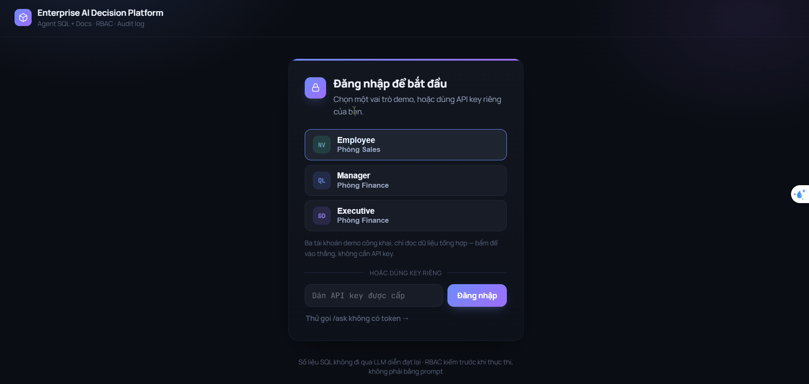
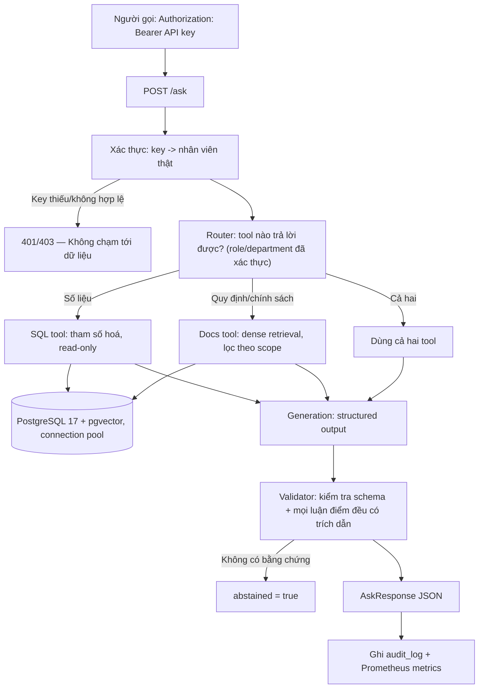

# Enterprise AI Decision Platform (Tiếng Việt)

🇻🇳 Tiếng Việt | 🇬🇧 [English](README.md)

API hỏi đáp nội bộ cho doanh nghiệp: nhân viên hỏi bằng ngôn ngữ tự nhiên, hệ thống tự quyết định câu trả lời nằm ở **số liệu kinh doanh (SQL)** hay **tài liệu quy trình nội bộ (retrieval)**, rồi trả lời **kèm trích dẫn nguồn**, **chỉ trong phạm vi quyền của người hỏi**, và **ghi nhật ký kiểm toán (audit log)** cho mọi lượt truy vấn.



### Trạng thái: báo cáo cuối cùng, vòng 2, trên tập held-out độc lập

- Sau khi corpus chuyển sang tiếng Việt có dấu đầy đủ (ADR-022), tập held-out
  vòng 1 và kết quả cũ được giữ nguyên làm hồ sơ lịch sử, và một tập 12 câu
  hoàn toàn mới (`eval/final.jsonl`) được viết và chạy **đúng một lần** qua
  endpoint `/ask` thật với cơ chế xác thực thật.
- **11/12 câu đúng**, 1 lỗi phân loại router thật (đúng kiểu lỗi của vòng 1,
  tái xuất hiện sau một lần đã sửa — xem mục "Giới hạn" bên dưới), **0 lỗi hạ
  tầng** ở trạng thái cuối cùng.
- Giữa lúc chạy, phát hiện và vá một lỗ hổng độ tin cậy thật: `src/embeddings.py`
  trước đây không hề có logic retry, khác với đường gọi generation/router, nên
  một lần 503 thoáng qua từ API embedding là giết chết ngay bất kỳ request nào
  chạm tới docs (ADR-024).
- Độ trễ thật p50/p95 và chi phí token thật cho mỗi request — đều đọc từ
  `audit_log`, không ước lượng.
- Chi tiết toàn bộ kết quả và lý do giữ nguyên không sửa lỗi router tái phát:
  [`docs/report.md`](docs/report.md) (mục "Final report, round 2") và ADR-024.
  Báo cáo vòng 1 (9/12, trên corpus trước khi có dấu) được giữ nguyên làm hồ
  sơ lịch sử trong cùng file.

**Bảo mật:** Endpoint `/ask` yêu cầu API key thật (`Authorization: Bearer <key>`)
— RBAC chạy dựa trên role/department **đã được xác thực**, không dùng trường
tự khai báo trong body request, đóng một lỗ hổng bảo mật thật đã được kiểm
chứng bằng thực nghiệm (ADR-015, có log `curl` trước/sau trong `docs/report.md`).
Mọi request đều được ghi vào `audit_log` và expose tại `/metrics` (Prometheus).
`/ask` định tuyến từng câu hỏi (Gemini phân loại `sql` / `docs` / cả hai) và
trả về số liệu SQL nguyên bản, tuyệt đối không để LLM diễn giải lại.

**Baseline retrieval:** 18/18 câu hỏi có đáp án được trích xuất chính xác, 0
trích dẫn bịa đặt, 0 vi phạm quyền trên 25 câu dev; hybrid retrieval đã được
đo đạc trước và **quyết định không xây dựng** — đạt 5/5 recall trên 5 câu diễn
giải khó, không có khoảng trống nào cần bù đắp (ADR-011).

Trình tự xây dựng và tiến độ: [`AGENTS.md`](AGENTS.md#7-kế-hoạch-xây-dựng).
Hướng dẫn thứ tự đọc chi tiết toàn bộ dự án có tại
[`docs/reading_order.md`](docs/reading_order.md).

## Vì sao làm project này

Ba tính chất quyết định một trợ lý LLM có thực sự dùng được trong doanh nghiệp hay không, và cả ba thường thiếu trong các bản demo thông thường:

| Tính chất | Nghĩa cụ thể trong repo này |
|---|---|
| **Câu trả lời kiểm chứng được** | Mọi luận điểm trả về đều phải có trích dẫn (citation) — một chunk tài liệu hoặc chính câu lệnh SQL đã sinh ra con số. Một câu trả lời không thể truy nguyên nguồn gốc bị coi là thất bại, không phải thành công. |
| **Phân quyền thật sự có hiệu lực** | Phạm vi quyền (Scope) được áp bằng bộ lọc trực tiếp trong mệnh đề `WHERE` của SQL và truy vấn vector, **trước khi** bất kỳ văn bản nào chạm tới mô hình LLM. Mô hình không bao giờ nhìn thấy chunk tài liệu mà người hỏi không được phép đọc. Việc dặn mô hình "đừng tiết lộ tài liệu mật" chỉ là một lời dặn (instruction), không phải một ranh giới bảo mật (boundary). |
| **Đo lường chứ không tuyên bố** | Mọi thay đổi trong retrieval đều được đánh giá trên một bộ câu hỏi cố định, với baseline được đo trước. Khẳng định "Hybrid search tốt hơn" chỉ có giá trị khi có số liệu thực nghiệm chứng minh. |

## Kiến trúc hệ thống



Chi tiết kiến trúc: [`docs/architecture.md`](docs/architecture.md).  
Các quyết định kỹ thuật và lý do: [`docs/decisions.md`](docs/decisions.md).

## Khởi động nhanh

Yêu cầu: Docker, [uv](https://docs.astral.sh/uv/), Python 3.12.

```bash
git clone https://github.com/anhquan1111/enterprise-ai-decision-platform.git
cd enterprise-ai-decision-platform
cp .env.example .env
# Dán API key từ Google AI Studio vào LLM_API_KEY — dùng cho embedding và generation

uv sync --extra dev
docker compose up -d db

# Khởi tạo schema, nạp dữ liệu nghiệp vụ, sau đó nạp corpus tài liệu
docker compose exec -T db psql -U app -d enterprise_ai -f /sql/00_extensions.sql
docker compose exec -T db psql -U app -d enterprise_ai -f /sql/01_schema.sql
docker compose exec -T db psql -U app -d enterprise_ai -f /sql/02_seed.sql
docker compose exec -T db psql -U app -d enterprise_ai -f /sql/06_auth.sql
uv run python -m scripts.ingest
uv run python -m scripts.backfill_embeddings    # tính embedding cho 16 chunk, idempotent
uv run python -m scripts.issue_api_keys         # cấp API key thật cho từng nhân viên, in ĐÚNG MỘT LẦN

uv run uvicorn src.api:app --reload --port 8010
# Xem tài liệu API tại: http://127.0.0.1:8010/docs
```

Thử đặt câu hỏi (cần lấy API key thật từ kết quả của `issue_api_keys` — `/ask` yêu cầu header `Authorization: Bearer <key>`; nếu thiếu key hoặc khai báo role không khớp với chủ sở hữu key, request bị từ chối ngay trước khi đụng vào dữ liệu — xem [`docs/report.md`](docs/report.md) mục xác thực & độ tin cậy):

```bash
KEY="<dán key của emp_006 vào đây — engineering/employee>"

# 1. Câu hỏi hợp lệ trong phạm vi quyền:
curl -s -X POST http://127.0.0.1:8010/ask -H "Content-Type: application/json" \
  -H "Authorization: Bearer $KEY" -d '{
  "user_id": "emp_006", "role": "employee", "department": "engineering",
  "question": "Neu mot ban release bi loi thi phai lam gi?"
}'
# Hệ thống route tới docs tool, trích dẫn ENG-007#1. 
# Nếu hỏi câu tương tự về hạn mức chi tiêu chỉ dành cho executive, hệ thống sẽ abstain thay vì đoán mò.

# 2. Thử giả mạo quyền (role không khớp với key đã cấp):
curl -s -X POST http://127.0.0.1:8010/ask -H "Content-Type: application/json" \
  -H "Authorization: Bearer $KEY" -d '{
  "user_id": "emp_006", "role": "executive", "department": "finance",
  "question": "Doanh thu phong finance thang 1 nam 2026 la bao nhieu?"
}'
# Trả về 403 Forbidden — key thuộc về "employee" phòng "engineering", role/department tự khai báo trong body
# không khớp với danh tính thực của key, nên request không bao giờ chạm tới agent. 
# Phân quyền RBAC luôn lấy từ key đã xác thực, không bao giờ tin dữ liệu body.
```

Xem cơ chế Data Contract chặn dữ liệu lỗi như thế nào mà không ảnh hưởng tới corpus sạch:

```bash
uv run python -m scripts.ingest data/documents_dirty.csv
# 8 dòng nạp vào, 0 dòng hợp lệ, 8 dòng bị đưa vào quarantine — mỗi dòng đều có reject_reason rõ ràng
```

Kiểm tra hệ thống:

```bash
curl http://127.0.0.1:8010/health    # Liveness check, không gọi DB
curl http://127.0.0.1:8010/ready     # Readiness check, có kiểm tra kết nối PostgreSQL
curl http://127.0.0.1:8010/metrics   # Endpoint scrape metrics của Prometheus, không yêu cầu auth
uv run pytest tests/ -v -m "not integration and not live_llm"   # Chạy nhanh, không cần mạng/DB
uv run pytest tests/ -v -m integration                          # Cần container db đang chạy
uv run pytest tests/ -v -m live_llm                              # Gọi Gemini thật, tiêu tốn quota
uv run python -m scripts.run_eval --report                       # Đọc báo cáo baseline đã có, không tốn quota
```

## Tech stack

| Tầng | Lựa chọn |
|---|---|
| Ngôn ngữ / API | Python 3.12 · FastAPI |
| Database | PostgreSQL 17 + pgvector 0.8.6 · psycopg 3, raw SQL (không dùng ORM), quản lý pool qua `psycopg_pool` |
| Validation | Pydantic 2 |
| LLM | Gemini `gemini-3.1-flash-lite` cho generation + agent router; `gemini-embedding-001` ở 384 chiều — gọi qua `httpx` thuần, không dùng SDK, không dùng function-calling API (router dùng JSON mode, cùng cách với generation) |
| Observability | prometheus-client · Prometheus · Grafana |
| Testing / quality | pytest · ruff · mypy |
| Hạ tầng | Docker Compose · GitHub Actions · Render Blueprint (`render.yaml`) |

MLflow được khai báo sẵn dưới dạng optional extra; chưa dùng tới. BM25 /
hybrid retrieval đã được đánh giá khi xây agent và chủ động không xây dựng —
xem ADR-011 trong [`docs/decisions.md`](docs/decisions.md).

## Cấu trúc thư mục

```text
src/
├── api.py             # FastAPI app: /health, /ready, /metrics, /ask
├── config.py          # Settings nạp từ env/.env
├── contracts.py       # Data contract: định nghĩa luật, mức nghiêm trọng (FATAL/WARNING)
├── db.py              # psycopg helpers, connection pool + statement timeout
├── auth.py            # Ánh xạ API key -> nhân viên đã xác thực (AuthN thật)
├── audit.py           # Ghi audit_log (bảng tồn tại một thời gian trước khi được dùng thật)
├── metrics.py         # Prometheus counters/histogram cho /ask
├── embeddings.py      # Gọi Gemini embedding, 1 hàm dùng chung cho ingest và query
├── retrieval.py        # Dense retrieval: lọc scope + point-in-time, sau đó xếp hạng cosine
├── generation.py      # Structured output: JSON mode, cơ chế retry khi lỗi, 2 cổng kiểm tra
├── eval_taxonomy.py    # Phân loại 8 nhãn lỗi (access / knowledge / retrieval / generation)
├── scope.py           # Phân quyền: Role -> access levels (docs); role+dept -> quyền SQL
├── agent/             # router + 2 tools + pipeline điều phối có giới hạn (bounded loop)
│   ├── router.py         # Gemini JSON mode: phân loại sql / docs / cả hai
│   ├── tools.py           # sql_tool (kiểm tra RBAC trước query), docs_tool (bọc retrieval.py)
│   ├── schema.py          # ToolPlan / SqlArgs, kiểm định hai lớp
│   └── loop.py            # route -> RBAC -> thực thi (retry/timeout) -> tổng hợp câu trả lời
└── schemas.py          # Contract dữ liệu request/response

scripts/
├── ingest.py                     # Luồng: đọc -> validate -> quarantine -> upsert -> manifest
├── backfill_embeddings.py        # Tính embedding cho các chunk chưa có, idempotent
├── issue_api_keys.py             # Cấp 1 API key duy nhất cho mỗi nhân viên, in 1 lần
├── run_eval.py                   # Đánh giá eval/dev.jsonl (pipeline docs), hỗ trợ chạy tiếp
├── run_held_out_eval.py          # Đánh giá eval/final.jsonl qua HTTP /ask thật, chạy đúng 1 lần
└── probe_retrieval_headroom.py   # Đo headroom để quyết định có cần hybrid retrieval hay không (ADR-011)

sql/                # 00 extensions, 01 schema, 02 seed, 03-05 queries/EXPLAIN, 06 auth
data/               # Corpus tổng hợp (16 chunk) + một tập dữ liệu bẩn cố ý để test
eval/               # dev.jsonl (25 câu dev, mở); final.jsonl (12 câu held-out, niêm phong)
evidence/           # Toàn bộ output thô làm căn cứ cho mọi con số trong báo cáo
docs/               # architecture.md, decisions.md, query_plan.md, report.md, runbook.md,
                    # demo_script.md, cv_bullets.md, reading_order.md
tests/              # Unit tests nhanh (mock); integration test cần Postgres;
                    # live_llm gọi Gemini thật — cả hai không chạy tự động trên CI
```

### Các lớp bảo vệ ở tầng dữ liệu

| Tầng | Vai trò ngăn chặn |
|---|---|
| `src/contracts.py` | Trùng lặp khóa chính, thiếu trường bắt buộc, giá trị nằm ngoài danh mục cho phép, khoảng thời gian hiệu lực đảo ngược, `available_at` đi trước `published_at`. Dòng lỗi bị đẩy vào `doc_chunks_quarantine` kèm lý do rõ ràng. |
| PostgreSQL constraints | Tái khẳng định các quy tắc trên ở tầng DB, bảo đảm script migration hoặc thao tác sửa tay khẩn cấp không thể lách qua code Python. |
| Bảng `ingest_run` | Mỗi lần chạy tạo một dòng manifest: thống kê vi phạm từng luật, và ràng buộc `CHECK` ép tổng số dòng hợp lệ + cách ly phải bằng số dòng trong file nạp. |

Kế hoạch truy vấn (Query plans) cho đường retrieval đo trên 16 dòng và ~20.000 dòng có trong [`docs/query_plan.md`](docs/query_plan.md).

## Đánh giá (Evaluation)

Số liệu đầy đủ, tên model, ngày chạy và hai lỗi đo lường phát hiện được trong quá trình thực hiện: [`docs/report.md`](docs/report.md). Tóm tắt:

| Chỉ số | Baseline retrieval (25 câu hỏi, `gemini-3.1-flash-lite`) |
|---|---|
| recall@3 / @5 / @10 | 18/18 (100%) — đồ thị phẳng vì tài liệu chuẩn luôn xếp hạng 1 |
| MRR | 1.000 |
| Câu trả lời đúng | 18/18 |
| Từ chối trả lời chính xác (ngoài quyền / không có kiến thức) | 5/5, 2/2 |
| Bịa trích dẫn, vi phạm quyền, trích xuất sót | 0 |

Tái hiện kết quả: `uv run python -m scripts.run_eval --report` (đọc kết quả đã lưu) hoặc `uv run python -m scripts.run_eval` (gọi API thật).

`eval/final.jsonl` ban đầu được để trống có chủ ý. Tập 5 câu held-out ban đầu bị chạy sớm — trước khi có agent và RBAC/audit, nên kết quả đó không đại diện cho toàn bộ hệ thống. Chúng được gộp vào `eval/dev.jsonl` thay vì xóa đi hay âm thầm chạy lại (xem ADR-010). Sau khi agent và tầng xác thực đều đã có, một tập held-out hoàn toàn mới mới được xây dựng.

Trước khi xây agent cũng đã đo đạc thực nghiệm xem hybrid retrieval có cải thiện được gì không trước khi bắt tay vào code: 5 câu diễn giải cố tình làm khó (dùng từ ngữ khác biệt nhất có thể so với câu hỏi dev) vẫn đạt 100% recall@3. Vì vậy, hybrid search không được xây dựng — xem ADR-011 và [`evidence/hybrid_headroom_probe.json`](evidence/hybrid_headroom_probe.json).

### Tập held-out vòng 2, chạy đúng một lần

| Chỉ số | Kết quả |
|---|---|
| Số câu hỏi held-out | 12 câu (`eval/final.jsonl`), hoàn toàn mới — xem ADR-024 |
| Trả lời chính xác | 11/12 |
| Lỗi hạ tầng ở trạng thái cuối cùng | 0/12 (giữa lúc chạy phát hiện và vá một lỗ hổng retry thật ở `embeddings.py` — xem ADR-024) |
| Router chọn sai tool cho câu hỏi kết hợp SQL + Docs | 1/12 (tái phát đúng lỗi của vòng 1, sau một lần đã sửa và đo 6/6 trên probe riêng — ADR-024) |
| Độ trễ p50 / p95 (gọi HTTP thật, cả 12 request hoàn thành) | 8.394 ms / 21.045 ms (bất thường cao — Gemini nghẽn thật hôm đó, xem ADR-024) |
| Chi phí token thật (`audit_log.total_tokens`) | Trung bình 834,4 token/request → $0,0025–$0,015 cho cả lần chạy (~65–390 VNĐ), một khoảng chứ không phải một con số điểm — xem ADR-023 |

Tái hiện kết quả: `uv run python -m scripts.run_held_out_eval --report` (bản thân lượt chạy không được lặp lại — đã được niêm phong; xem `docs/report.md`, mục "Final report, round 2"). Vòng 1 (9/12, trên corpus trước khi có dấu, 12 câu khác) được giữ nguyên làm hồ sơ lịch sử trong cùng báo cáo và trong `eval/final_v1_pre_diacritics.jsonl` — xem ADR-022. Lỗi router tái phát (H21) đã được **chủ động giữ nguyên, không sửa rồi chạy lại** — vì tập held-out đã chấm điểm rồi, sửa lúc này sẽ làm mất đi ý nghĩa đánh giá khách quan; xem ADR-024.

## Giới hạn của hệ thống

- Corpus tài liệu là **dữ liệu tổng hợp (synthetic)**, được viết riêng cho dự án này. Không dùng tài liệu thật của bất kỳ doanh nghiệp nào.
- Vector search dùng phương pháp exact search qua pgvector, chưa đánh index ANN (HNSW/IVFFlat). Đúng đắn ở quy mô vài trăm chunk; không đại diện cho khả năng mở rộng lên hàng triệu chunk.
- Bộ 25 câu trên corpus 16 chunk là quy mô phục vụ học tập và định vị lỗi. Kết quả không có lỗi nào ở baseline là kết quả thực tế trên bộ dữ liệu này, **không phải bằng chứng** rằng hệ thống hoàn toàn tin cậy trong mọi tình huống thực tế — xem mục "Not yet measured" trong `docs/report.md`.
- Một câu hỏi vừa hỏi số liệu vừa hỏi chính sách trong một câu trước đây đôi khi chỉ được route tới một tool (quan sát được khi xây agent, tập held-out vòng 1 xác nhận lại lần nữa). Sau đó prompt router đã được gia cố và đạt 6/6 trên bài kiểm tra mới (`evidence/router_combined_tools_probe.json`) — đây là sự cải thiện trên mẫu nhỏ, không phải cam kết tuyệt đối ở quy mô lớn (ADR-020). Lỗi này tái phát ở tập held-out vòng 2 (câu H21) — 6 mẫu chưa đủ để coi khoảng trống đã đóng (ADR-024). **Một probe lớn hơn hẳn (18 câu mới, có câu cố tình mô phỏng sát H21) sau đó chạy trên đúng prompt chưa sửa và ra 18/18 đúng, không tái hiện được lỗi nào** — khoảng 2 lần bỏ sót trên ~26 lượt câu hỏi kết hợp trong toàn bộ dự án phù hợp với sai số ngẫu nhiên bình thường của LLM, không phải lỗ hổng hệ thống; để nguyên không vá vì không có ca lỗi cụ thể để nhắm vào. Xem ADR-027.
- Phản hồi tự mâu thuẫn từ model (`abstained: true` nhưng danh sách `citations` lại có nội dung) trước đây gây lỗi 502 sau khi thử lại hết số lần — đã được sửa để tự động giáng cấp thành từ chối trả lời hợp lệ (bỏ citations, ghi nhận vào `grounding_problems`). Xem ADR-020.
- Lỗi timeout mạng thuần túy khi gọi Gemini (`httpx.TimeoutException`/`ConnectError`) trước đây vô tình bỏ qua vòng lặp retry — đã được sửa để tự retry tương tự như mã lỗi HTTP 503 (xem ADR-020).
- Cơ chế xác thực AuthN ban đầu chỉ có API key dạng chuỗi bí mật, không hết hạn tự động, thu hồi bằng cách xoá thủ công `api_key_hash` (ADR-015). **`POST /auth/token` giờ đổi một API key hợp lệ lấy một JWT ngắn hạn** (mặc định 60 phút, `HS256`, `authenticate()` chấp nhận cả hai) — API key vẫn dùng trực tiếp cho `/ask` như cũ, không đổi gì; JWT thêm hết hạn tự động, chưa phải thu hồi tức thời (xem ADR-028 để biết còn thiếu gì cho việc đó).
- Jitter trong cơ chế retry được thêm để giải quyết hiện tượng tranh chấp gây lỗi `503` đồng thời (ADR-016), và đã được đo lại dưới tải đồng thời thật (8 lượt × 3 request, có/không jitter) — không thấy cải thiện đo được dưới mức nghẽn Gemini bất thường cao của phiên đo; ngân sách retry tự nó ngắn hơn một đợt nghẽn kéo dài — một khoảng trống khác với khoảng jitter đã đóng. Xem ADR-026.
- Chi phí token được quy đổi ra VNĐ/USD dưới dạng một khoảng (`audit_log` chỉ lưu tổng token, chưa tách input/output) — xem ADR-023.
- Mặc định chạy cục bộ qua Docker Compose. Repo có sẵn Render Blueprint
  (`render.yaml`) để deploy 1-click lên một URL công khai — xem
  [`docs/deploy_render.md`](docs/deploy_render.md) để biết các bước cụ thể và
  giới hạn thật của gói free (cold start, Postgres hết hạn sau 30 ngày).

## Tài liệu Demo và CV

- [`docs/demo_script.md`](docs/demo_script.md) — Kịch bản demo 2–3 phút, xây dựng hoàn toàn từ các lệnh và kết quả có thể tái hiện ở trên.
- **`/ui`** — trang demo HTML/CSS/JS thuần (không framework, không build step), do
  chính API phục vụ tại `http://127.0.0.1:8010/ui/`: ba nút đăng nhập nhanh
  (employee/manager/executive, qua `POST /auth/demo-token` — không API key nào lộ
  ra ở frontend, ADR-031), câu hỏi chính sách, câu hỏi doanh thu đúng phòng ban,
  câu so sánh liên phòng ban (chỉ executive, ADR-030), và một câu hỏi sai phòng
  ban để xem RBAC chặn — cùng luồng `/auth/token` + `/ask` như bản demo curl,
  chỉ là dễ bấm hơn, tự phục vụ được cho bất kỳ ai mở link đã deploy.
- [`docs/demo_script_ui.md`](docs/demo_script_ui.md) — kịch bản quay GIF ~60 giây
  dùng `/ui` kèm dashboard Grafana thật.
- [`docs/deploy_render.md`](docs/deploy_render.md) — cách deploy `/ui` lên một URL
  công khai bằng blueprint `render.yaml` có sẵn.
- [`docs/cv_bullets.md`](docs/cv_bullets.md) — Các gạch đầu dòng đưa vào CV, mỗi con số đều trỏ về một file hoặc ADR trong repo, không có con số nào được bịa ra ngoài `evidence/`.
- [`docs/reading_order.md`](docs/reading_order.md) — Thứ tự đọc toàn bộ dự án (khoảng 170 phút).

## Giấy phép

MIT
