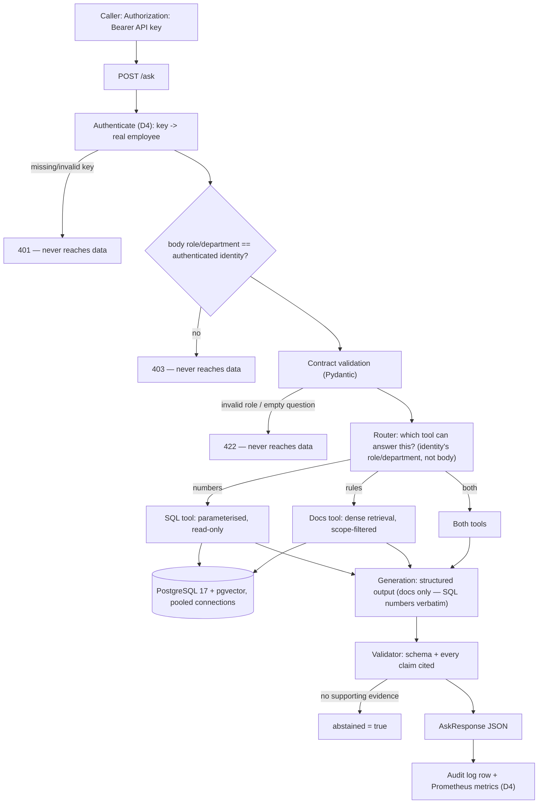

# Architecture

## The question this system answers

An employee asks a question in natural language. It may need a **number** ("what
was Sales revenue last quarter?"), a **rule** ("what is my expense approval
limit?"), or **both**. The system must answer only from evidence the asker is
allowed to see, show where the answer came from, and refuse when the evidence
does not support an answer.

## Request flow



## Why the scope is resolved before the router, not inside the prompt

Access control is applied as a filter in the SQL `WHERE` clause and in the
retrieval query, before any text reaches the language model. The model never sees
a chunk the caller may not read.

The alternative — telling the model "do not reveal documents above the caller's
level" — is an instruction, not a boundary. Instructions in a prompt can be
overridden by text that arrives later, including text inside a retrieved
document. That is the prompt-injection path this design removes rather than
mitigates.

## Why role/department come from the authenticated identity, not the request body (D4)

Through D3, `AskRequest.role`/`department` were trusted at face value — nothing
verified the caller actually held that role. Measured proof this was exploitable:
an unauthenticated request self-declaring `role=executive` received an
executive-only document (see ADR-015). D4 requires a real API key
(`Authorization: Bearer <key>`, `src/auth.py`); the RBAC/agent layer uses the
role/department looked up from the authenticated employee record, never the
request body's fields. The body fields are still validated against the
authenticated identity (mismatch → `403`) as a defense-in-depth signal for client
bugs, but they are not the source of truth for access control.

## Module layout

```text
src/
├── api.py          # FastAPI app: /health, /ready, /metrics, /ask
├── config.py       # Settings from env/.env, single source of truth
├── db.py           # psycopg helpers; pooled connections (D4), statement timeout
├── auth.py         # D4: API key -> authenticated employee (real AuthN, ADR-015)
├── audit.py        # D4: writes audit_log (table existed since D1, unused until now)
├── metrics.py      # D4: Prometheus counters/histogram for /ask
├── scope.py        # visible_access_levels (docs), can_query_department (SQL, D3)
├── retrieval.py    # Dense retrieval for docs (D2)
├── generation.py   # Structured output for docs answers (D2)
├── agent/          # D3: router (Gemini) + 2 tools (SQL, docs) + orchestration loop
│   ├── router.py   # Classifies a question into sql/docs/both
│   ├── tools.py    # sql_tool (RBAC before query), docs_tool (wraps retrieval.py)
│   ├── schema.py   # ToolPlan / SqlArgs — two-layer validation, see ADR pattern in D2
│   └── loop.py     # Bounded pipeline: route -> RBAC -> execute -> summarize (ADR-013)
└── schemas.py      # Request/response contracts (Role, Department, Citation)

sql/                # Schema and seed, applied with psql (D1); 06_auth.sql (D4)
eval/               # Evaluation questions with ground truth (D2)
evidence/           # Raw outputs behind every number in the README
scripts/            # One-purpose CLI entry points (ingestion, eval runs, probes,
                    # issue_api_keys.py for D4)
docs/               # architecture.md, decisions.md, report.md, runbook.md (D4)
```

## Build order

Each day adds one layer and leaves the previous layers working. The
evaluation harness comes **before** the retrieval improvements on purpose: without
a baseline measured first, "hybrid search is better" is an opinion.

| Day | Layer | Depends on | Status |
|---|---|---|---|
| D0 | Skeleton: config, DB access, contracts, health/ready, CI | — | done |
| D1 | Schema + contract-validated ingestion | D0 | done |
| D2 | Dense retrieval, structured output, **eval set + baseline numbers** | D1 | done — `docs/report.md` |
| D3 | Agent routing (SQL + docs), RBAC for SQL, retry/timeout | D2 | done — `docs/report.md`, ADR-011/012/013. Hybrid retrieval measured and **not built** — see ADR-011 |
| D4 | AuthN (API key), audit log, Prometheus, connection pool, statement timeout, retry jitter | D1, D3 | done — `docs/report.md`, ADR-015/016/017 |
| D5 | Final report on a fresh held-out set, README, demo | all | done — `docs/report.md`, ADR-018/019 |

## Known limits (kept current)

- `/ask` answers both document questions (dense retrieval, D2) and business-number
  questions (SQL tool, D3): a Gemini router classifies each question as `sql`, `docs`,
  or both, RBAC is checked per tool **before** execution using the authenticated
  identity's role/department (D4, ADR-015), and SQL numbers are returned verbatim —
  never rephrased by an LLM (ADR-013).
- Hybrid retrieval was measured and deliberately **not built** at D3 — dense embeddings
  handled every paraphrase tried, including deliberately hard ones. See ADR-011.
- A question asking for both a number and a policy in one sentence used to be routed
  to only one tool sometimes (D3, confirmed by the D5 held-out set) — the router
  prompt was strengthened afterward, measured 6/6 on a fresh probe. Small sample,
  not a guarantee at scale. See ADR-020.
- A self-contradictory model response (`abstained: true` with non-empty citations)
  used to 502 after retries — now degrades to a plain abstain instead (citations
  dropped, logged in `grounding_problems`). Found by the D5 held-out run, fixed
  afterward without touching the sealed set. See ADR-020.
- A raw network timeout to Gemini (`httpx.TimeoutException`/`ConnectError`) used to
  skip `router.py`/`generation.py`'s retry loop entirely — now retried the same as
  an HTTP 503. Found by the D5 held-out run, fixed afterward. See ADR-020.
- AuthN (D4) is possession-based API keys, not JWT/OAuth2 — no built-in expiry or
  instant revocation (only manual deletion of `api_key_hash`). See ADR-015 for when
  to upgrade.
- Retry jitter (D4) was added for the exact mechanism measured causing concurrent
  `503`s (vault, ngày 25), but the fix itself has not been re-measured under the same
  concurrent-load scenario — see ADR-016.
- Token cost (D5) is real (`audit_log.total_tokens`, ADR-018) but reported in tokens,
  not currency — no reliable per-token pricing lookup was available at measurement
  time. See `docs/report.md`.
- The corpus is synthetic, written for this project. No real company documents.
- Exact vector search, no ANN index — correct at a few hundred chunks, not a
  statement about scale.
