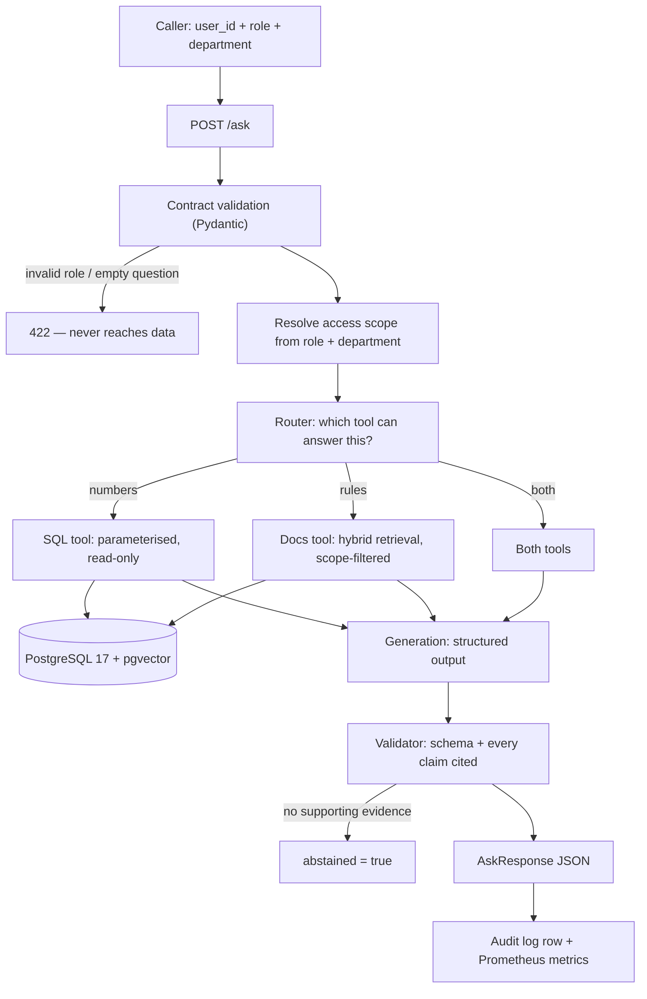

# Architecture

## The question this system answers

An employee asks a question in natural language. It may need a **number** ("what
was Sales revenue last quarter?"), a **rule** ("what is my expense approval
limit?"), or **both**. The system must answer only from evidence the asker is
allowed to see, show where the answer came from, and refuse when the evidence
does not support an answer.

## Request flow



## Why the scope is resolved before the router, not inside the prompt

Access control is applied as a filter in the SQL `WHERE` clause and in the
retrieval query, before any text reaches the language model. The model never sees
a chunk the caller may not read.

The alternative — telling the model "do not reveal documents above the caller's
level" — is an instruction, not a boundary. Instructions in a prompt can be
overridden by text that arrives later, including text inside a retrieved
document. That is the prompt-injection path this design removes rather than
mitigates.

## Module layout

```text
src/
├── api.py          # FastAPI app: /health, /ready, /ask
├── config.py       # Settings from env/.env, single source of truth
├── db.py           # psycopg helpers; read-only sessions for the query path
└── schemas.py      # Request/response contracts (Role, Department, Citation)

sql/                # Schema and seed, applied with psql (D1)
eval/               # Evaluation questions with ground truth (D2)
evidence/           # Raw outputs behind every number in the README
scripts/            # One-purpose CLI entry points (ingestion, eval runs)
docs/               # architecture.md, decisions.md, report.md (D5)
```

## Build order

Each day adds one layer and leaves the previous layers working. The
evaluation harness comes **before** the retrieval improvements on purpose: without
a baseline measured first, "hybrid search is better" is an opinion.

| Day | Layer | Depends on |
|---|---|---|
| D0 | Skeleton: config, DB access, contracts, health/ready, CI | — |
| D1 | Schema + contract-validated ingestion | D0 |
| D2 | Dense retrieval, structured output, **eval set + baseline numbers** | D1 |
| D3 | Hybrid retrieval measured against D2 baseline, agent routing | D2 |
| D4 | RBAC scoping, audit log, timeouts | D1, D3 |
| D5 | Final report on held-out questions, README, demo | all |

## Known limits (kept current)

- `/ask` returns 501 until D2. The contract is enforced; the answer path is not built.
- The corpus is synthetic, written for this project. No real company documents.
- Exact vector search, no ANN index — correct at a few hundred chunks, not a
  statement about scale.
