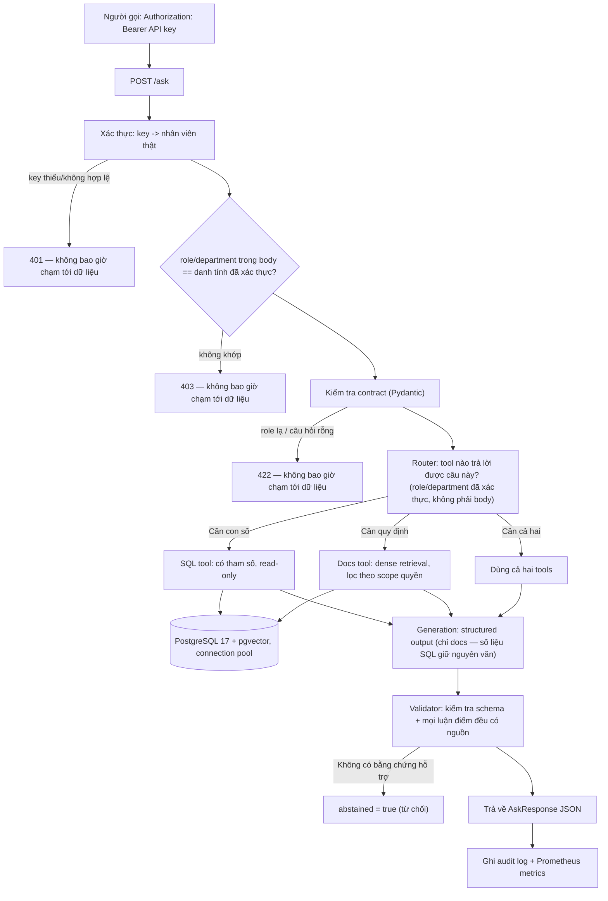

# Kiến trúc hệ thống (Architecture)

## Câu hỏi mà hệ thống này trả lời

Một nhân viên đặt câu hỏi bằng ngôn ngữ tự nhiên. Câu hỏi có thể cần một **con số** ("doanh thu phòng Sales quý trước là bao nhiêu?"), một **quy định** ("hạn mức phê duyệt chi phí của tôi là bao nhiêu?"), hoặc **cả hai**.

Hệ thống bắt buộc phải:
1. Chỉ trả lời dựa trên những bằng chứng mà người hỏi **được phép nhìn thấy**.
2. Chỉ rõ câu trả lời **đến từ đâu** (dẫn nguồn citation: đoạn văn bản nào hoặc câu SQL nào).
3. **Từ chối trả lời** (abstention) khi bằng chứng không đủ để hỗ trợ câu trả lời.

---

## Luồng xử lý một request



---

## Vì sao scope quyền được xử lý TRƯỚC router, không phải bên trong prompt

Kiểm soát truy cập (access control) được áp dụng như một bộ lọc trực tiếp trong mệnh đề `WHERE` của SQL và trong câu truy vấn retrieval, **trước khi bất kỳ đoạn văn bản nào đến được mô hình ngôn ngữ (LLM)**. Mô hình sẽ không bao giờ nhìn thấy một đoạn chunk nào mà người gọi không có quyền đọc.

Cách làm ngược lại — dặn mô hình trong prompt: *"đừng tiết lộ tài liệu vượt cấp của người gọi"* — chỉ là một **lời dặn dò**, không phải là một **ranh giới bảo mật**. Lời dặn dò trong prompt có thể bị ghi đè bởi văn bản đến sau (kể cả văn bản độc hại nằm bên trong tài liệu được retrieve ra).

Đó chính là con đường **prompt injection** mà kiến trúc này **loại bỏ tận gốc** thay vì chỉ tìm cách giảm thiểu.

## Vì sao role/department lấy từ danh tính đã xác thực, không phải từ body request

Trước khi được vá, `AskRequest.role`/`department` được tin tưởng nguyên văn — không có gì xác minh người gọi thật sự giữ vai trò đó. Bằng chứng đo được rằng điều này khai thác được: một request chưa xác thực tự khai `role=executive` đã nhận được một tài liệu chỉ dành cho executive (xem ADR-015). Bản vá yêu cầu một API key thật (`Authorization: Bearer <key>`, `src/auth.py`); tầng RBAC/agent dùng role/department tra được từ bản ghi nhân viên đã xác thực, không bao giờ dùng trường trong body. Các trường trong body vẫn được đối chiếu với danh tính đã xác thực (không khớp → `403`) như một lớp phòng thủ bổ sung cho lỗi phía client, nhưng đó không phải nguồn sự thật cho phân quyền.

---

## Cấu trúc thư mục (Module layout)

```text
src/
├── api.py          # FastAPI app: /health, /ready, /metrics, /ask
├── config.py       # Cấu hình từ env/.env, nguồn sự thật duy nhất
├── db.py           # Helper psycopg; connection pool, statement timeout
├── auth.py         # API key -> nhân viên đã xác thực (AuthN thật, ADR-015)
├── audit.py        # Ghi audit_log (bảng tồn tại một thời gian trước khi được dùng thật)
├── metrics.py      # Prometheus counters/histogram cho /ask
├── scope.py        # visible_access_levels (docs), can_query_department (SQL)
├── retrieval.py    # Dense retrieval cho docs
├── generation.py   # Structured output cho câu trả lời docs
├── agent/          # router (Gemini) + 2 tools (SQL, docs) + vòng điều phối
│   ├── router.py   # Phân loại một câu hỏi thành sql/docs/cả hai
│   ├── tools.py    # sql_tool (kiểm RBAC trước khi query), docs_tool (bọc retrieval.py)
│   ├── schema.py   # ToolPlan / SqlArgs — kiểm định hai lớp
│   └── loop.py     # Pipeline có giới hạn: route -> RBAC -> thực thi -> tổng hợp (ADR-013)
└── schemas.py      # Contracts request/response (Role, Department, Citation)

sql/                # Schema và seed data, nạp bằng psql; 06_auth.sql thêm AuthN
eval/               # Bộ câu hỏi đánh giá kèm đáp án chuẩn ground truth
evidence/           # Log kết quả thô đằng sau mọi con số trong README
scripts/            # Các script CLI chạy tác vụ đơn lẻ (ingestion, chạy eval, probe,
                    # issue_api_keys.py)
docs/               # architecture.md, decisions.md, report.md, runbook.md
```

---

## Thứ tự xây dựng (Build order)

Mỗi giai đoạn thêm một tầng và luôn giữ các tầng trước hoạt động bình thường. Bộ khung đánh giá (evaluation harness) được xây dựng **trước** các cải tiến retrieval có chủ đích: nếu không đo baseline chuẩn trước, thì tuyên bố "hybrid search tốt hơn" chỉ là cảm tính.

| Giai đoạn | Tầng | Phụ thuộc vào | Trạng thái |
|---|---|---|---|
| Bộ khung | config, kết nối DB, contracts, health/ready, CI | — | xong |
| Tầng dữ liệu | Schema + ingestion có kiểm tra contract | Bộ khung | xong |
| Retrieval nền tảng | Dense retrieval, structured output, **bộ eval + số liệu baseline** | Tầng dữ liệu | xong — `docs/report.md` |
| Điều phối agent | SQL + docs tools, RBAC cho SQL, retry/timeout | Retrieval nền tảng | xong — `docs/report.md`, ADR-011/012/013. Hybrid retrieval đã đo và **quyết định không xây** — xem ADR-011 |
| Xác thực & độ tin cậy | AuthN (API key), audit log, Prometheus, connection pool, statement timeout, retry jitter | Tầng dữ liệu, Điều phối agent | xong — `docs/report.md`, ADR-015/016/017 |
| Báo cáo cuối | Báo cáo cuối trên tập held-out mới, README, demo | Toàn bộ | xong — `docs/report.md`, ADR-018/019 |

---

## Giới hạn đã biết (Known limits)

- `/ask` trả lời cả câu hỏi tài liệu (dense retrieval) lẫn câu hỏi số liệu kinh doanh (SQL tool): router Gemini phân loại mỗi câu hỏi thành `sql`, `docs`, hoặc cả hai; RBAC được kiểm cho từng tool **trước khi** thực thi, dùng role/department của danh tính đã xác thực (ADR-015); số liệu SQL trả về nguyên văn — không bao giờ để LLM diễn giải lại (ADR-013).
- Hybrid retrieval đã được đo và chủ động **không xây dựng** — dense embeddings xử lý tốt mọi câu diễn giải đã thử, kể cả những câu cố tình làm khó. Xem ADR-011.
- Một câu hỏi vừa hỏi số liệu vừa hỏi chính sách trong một câu trước đây đôi khi chỉ được route tới một tool (được xác nhận độc lập lần nữa bởi tập held-out) — sau đó prompt router được gia cố, đo được 6/6 trên một bài kiểm tra mới. Mẫu nhỏ, không phải cam kết ở quy mô lớn. Xem ADR-020.
- Một response tự mâu thuẫn của model (`abstained: true` kèm citations không rỗng) trước đây gây lỗi 502 sau khi hết lượt retry — giờ tự suy biến thành một lượt từ chối hợp lệ (bỏ citations, ghi vào `grounding_problems`). Phát hiện qua tập held-out, đã vá sau đó mà không đụng vào tập đã niêm phong. Xem ADR-020.
- Một lỗi timeout mạng thuần túy khi gọi Gemini (`httpx.TimeoutException`/`ConnectError`) trước đây bỏ qua hoàn toàn vòng lặp retry của `router.py`/`generation.py` — giờ được retry giống hệt một lỗi HTTP 503. Phát hiện qua tập held-out, đã vá sau đó. Xem ADR-020.
- AuthN dùng API key dạng sở hữu (possession-based), chưa phải JWT/OAuth2 — chưa có tính năng hết hạn tự động hay thu hồi tức thì (chỉ xóa thủ công `api_key_hash`). Xem ADR-015 để biết khi nào cần nâng cấp.
- Jitter cho retry được thêm vào đúng cơ chế đã đo được gây lỗi `503` đồng thời, nhưng bản vá chưa được đo lại dưới đúng kịch bản tải đồng thời đó — xem ADR-016.
- Chi phí token là số đo thật (`audit_log.total_tokens`, ADR-018) nhưng báo cáo bằng token, chưa quy đổi ra tiền tệ — chưa có bảng giá tra cứu theo token đáng tin cậy tại thời điểm đo. Xem `docs/report.md`.
- Corpus tài liệu là dữ liệu tổng hợp (synthetic), viết riêng cho dự án này, không phải tài liệu công ty thật.
- Vector search dùng exact search, chưa có index ANN — đúng đắn ở quy mô vài trăm chunk, không phải một tuyên bố về khả năng mở rộng.
