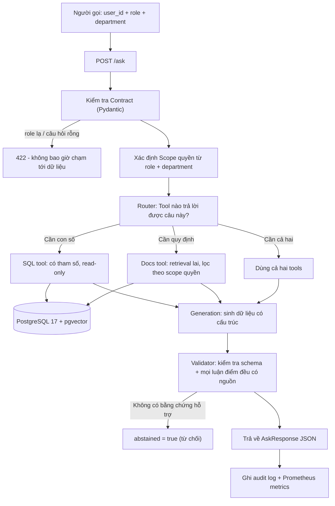

# Kiến trúc hệ thống (Architecture)

## Câu hỏi mà hệ thống này trả lời

Một nhân viên đặt câu hỏi bằng ngôn ngữ tự nhiên. Câu hỏi có thể cần một **con số** ("doanh thu phòng Sales quý trước là bao nhiêu?"), một **quy định** ("hạn mức phê duyệt chi phí của tôi là bao nhiêu?"), hoặc **cả hai**. 

Hệ thống bắt buộc phải:
1. Chỉ trả lời dựa trên những bằng chứng mà người hỏi **được phép nhìn thấy**.
2. Chỉ rõ câu trả lời **đến từ đâu** (dẫn nguồn Citation: đoạn văn bản nào hoặc câu SQL nào).
3. **Từ chối trả lời** (Abstention) khi bằng chứng không đủ để hỗ trợ câu trả lời.

---

## Luồng xử lý một Request (Request flow)



---

## Vì sao Scope quyền được xử lý TRƯỚC Router, không phải bên trong Prompt?

Kiểm soát truy cập (Access control) được áp dụng như một bộ lọc trực tiếp trong mệnh đề `WHERE` của SQL và trong câu truy vấn retrieval, **trước khi bất kỳ đoạn văn bản nào đến được mô hình ngôn ngữ (LLM)**. Mô hình sẽ không bao giờ nhìn thấy một đoạn chunk nào mà người gọi không có quyền đọc.

Cách làm ngược lại — dặn mô hình trong prompt: *"đừng tiết lộ tài liệu vượt cấp của người gọi"* — chỉ là một **lời dặn dò**, không phải là một **ranh giới bảo mật**. Lời dặn dò trong prompt có thể bị ghi đè bởi văn bản đến sau (kể cả văn bản độc hại nằm bên trong tài liệu được retrieve ra). 

Đó chính là con đường **Prompt-Injection** mà kiến trúc này **loại bỏ tận gốc** thay vì chỉ tìm cách giảm thiểu.

---

## Cấu trúc thư mục (Module layout)

```text
src/
├── api.py          # FastAPI app: /health, /ready, /ask
├── config.py       # Cấu hình từ env/.env, nguồn sự thật duy nhất
├── db.py           # Helper psycopg; session read-only cho luồng query
└── schemas.py      # Contracts request/response (Role, Department, Citation)

sql/                # Schema và seed data, nạp bằng psql (D1)
eval/               # Bộ câu hỏi đánh giá kèm đáp án chuẩn ground truth (D2)
evidence/           # Log kết quả thô đằng sau mọi con số trong README
scripts/            # Các script CLI chạy tác vụ đơn lẻ (ingestion, chạy eval)
docs/               # architecture.md, decisions.md, report.md (D5)
```

---

## Thứ tự xây dựng (Build order)

Mỗi ngày thêm một tầng và luôn giữ các tầng trước hoạt động bình thường. Bộ khung đánh giá (Evaluation harness) được xây dựng **trước** các cải tiến retrieval có chủ đích: nếu không đo baseline chuẩn trước, thì tuyên bố "hybrid search tốt hơn" chỉ là cảm tính.

| Ngày | Tầng | Phụ thuộc vào |
|---|---|---|
| **D0** | Bộ khung: config, kết nối DB, contracts, health/ready, CI | — |
| **D1** | Schema + Ingestion có kiểm tra contract | D0 |
| **D2** | Dense retrieval, structured output, **bộ eval + số liệu baseline** | D1 |
| **D3** | Hybrid retrieval so sánh với baseline D2, agent routing | D2 |
| **D4** | Phân quyền RBAC, audit log, timeouts | D1, D3 |
| **D5** | Báo cáo cuối trên tập câu hỏi held-out, README, demo | Toàn bộ |

---

## Giới hạn đã biết (Known limits)

- `/ask` trả về HTTP 501 cho đến D2. Contract được thực thi nghiêm ngặt; nhưng luồng sinh câu trả lời chưa lắp ráp.
- Bộ dữ liệu tài liệu là dữ liệu giả lập (synthetic) được viết riêng cho dự án này, không phải tài liệu công ty thật.
- Tìm kiếm vector chính xác (Exact search), chưa tạo index ANN — hoàn toàn đúng đắn ở quy mô vài trăm chunks.
